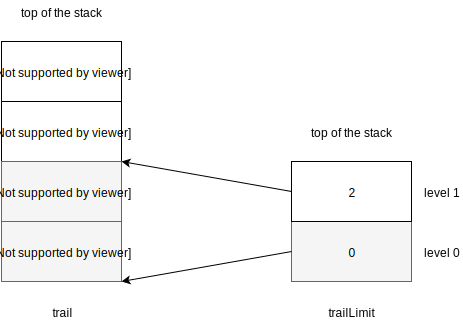
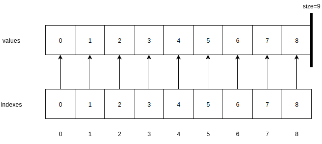
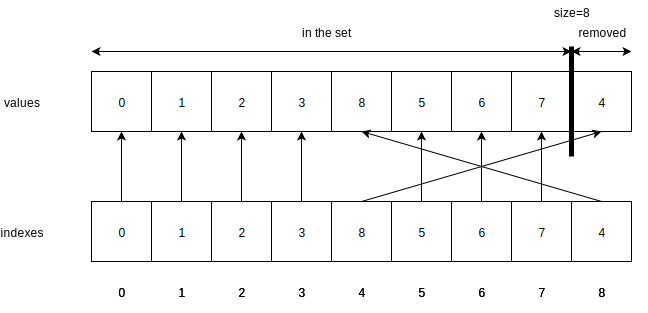
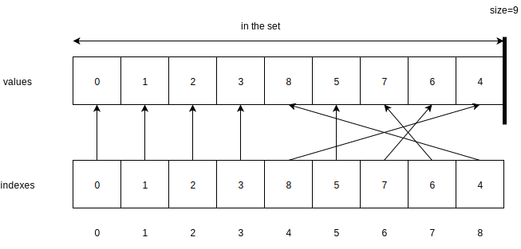
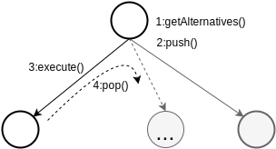
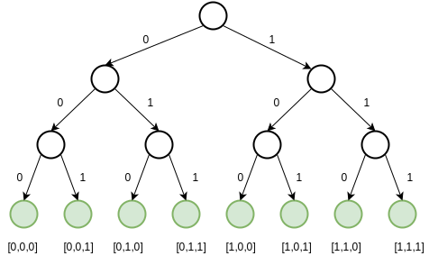

.. _minicp:

******************************
mini-cp
******************************

Trailing
===================================================

.. javaimport::
    java.util.*

The core of a CP solver is a mechanism called  *trail* that is
able to store and restore the state of objects.
To keep things simple, you can view a trail as an implementation
for `undo` operations.

ReversibleContext
------------------

The trailing mechanism is implemented
into the class :javaref:`minicp.reversible.ReversibleContext`.

Mini-cp provides two types of reversible objects that can be created
within a reversible context:

* :javaref:`minicp.reversible.ReversibleInt`
* :javaref:`minicp.reversible.ReversibleBool`

The next example manipulates ``ReversibleInt`` objects within a ``ReversibleContext``:

.. literalinclude:: ../../src/test/java/minicp/reversible/ReversibleIntTest.java
        :language: java
        :linenos:
        :lines: 33-72

A reversible context has two operations ``push`` and ``pop``:

* The ``push`` operation records the state of all the objects created in this context. The reversible context is a stack of states recorded at the time of the ``push`` operations.
* The ``pop`` operation restores and removes top-most state of the stack of states. The ``pop`` as like an undo operation.

In the above example, one can see that the first ``pop`` operation
restores the objects at the value they had at the time of the previous push operation: `a=11,b=13`.
As a side effect the ``pop`` unstacks the top most state from the trail.
The second ``pop`` operation, unstacks and restores the state one more time
as it was at previous ``push`` operation: `a=7,b=13`.

Let us now see how this is implemented inside mini-cp.
The objects that are stacked and able to restore the state implements the
:javaref:`minicp.reversible.TrailEntry` interface:

.. literalinclude:: ../../src/main/java/minicp/reversible/TrailEntry.java
                :language: java
                :linenos:
                :lines: 27-29

The ``restore`` method is the one that is called when ``pop`` is executed on the context to restore the state.
A :javaref:`minicp.reversible.ReversibleContext` internally contains two stacks:

* ``trail`` that stacks  ``TrailEntry`` objects making it possible to restore the state.
* ``trailLimit`` that stacks the current size of ``trail`` when a ``push`` operation occurs. This allows to delimit the number ``TrailEntry`` that need to be restored whenever a pop operation is executed.

.. code-block:: java
    :emphasize-lines: 3,4
    :linenos:

    public class ReversibleContext {
        public long magic = 0;
        private Stack<TrailEntry> trail = new Stack<TrailEntry>();
        private Stack<Integer>    trailLimit = new Stack<Integer>();
    }

The ``magic`` number is also called a `timestamp` and is incremented each time a ``push``
or ``pop`` operation occurs.
This implementation trick allows to optimize the number of trail entries by recording
at most one trail entry per reversible object between any two push operations.
This will become more clearly explained after when studying
the implementation of the :javaref:`minicp.reversible.ReversibleInt`.

A representation of the ``trail`` and ``trailLimit`` stacks for the above example
before the first pop operation is executed is given next.
For each trail entry, we give the identifier it refers to and the value that
would be restored.

Although you can already probably guess how it is implemented,
we invite you to read the code of :javaref:`minicp.reversible.ReversibleContext` to learn
more about the implementation of the ``pop`` operation.

Reversible Integers
---------------------

The most used reversible data structure is surely :javaref:`minicp.reversible.ReversibleInt`.
By studying its implementation you will be able to implement your own reversible
objects into mini-cp if necessary.

.. literalinclude:: ../../src/main/java/minicp/reversible/ReversibleInt.java
    :language: java
    :linenos:
    :lines: 23-68

First notice that ``ReversibleInt`` has its own implementation of ``TrailEntry``
as an inner class called ``TrailEntryInt``.
The ``restore`` method of this class simply restores the content of the instance variable
``ReversibleInt.this.v`` (the one of the ``TrailEntryInt``) to the value
``v`` recorded in the entry.

Observe that ``setValue`` has no effect if the value set is the same as the current
value for ``this.v``.
On the contrary, if it is not the same, a ``TrailEntryInt`` must
be pushed on the trail (with ``context.pushOnTrail``) otherwise the content of ``this.v`` would be definitively lost
and it would be impossible to restore it in the future.

The test ``if (lastMagic != contextMagic)`` is an implementation optimisation, not strictly necessary.
It prevents to create more than one trail entry for a same instance
of a ``ReversibleInt`` between two subsequent ``push`` operations.
The rationale being that it is unnecessary to remember the intermediate values,
only the last one matters, that is the internal value at the time of the ``push``.
As the ``push`` operation increments the ``magic`` number of the reversible context,
the next call to ``setValue`` will correctly add a trail entry on the trail stack.

Reversible Sparse-Sets
------------------------

A :javaref:`minicp.reversible.ReversibleSparseSet` is a reversible data structure for set representation.
A reversible sparse-set implementation starts with a full set of n values from 0 to n-1 and only allows
the removal of values (no insertion possible).

The advantages of this data structures are that:

* efficiency: the removal of a value and testing if a value is present in the set takes constant time.
* light reversibility: only one internal reversible integer is necessary.

A small example manipulating such as set is given next.

.. literalinclude:: ../../src/test/java/minicp/reversible/ReversibleSparseSetTest.java
    :language: java
    :linenos:
    :lines: 36-52

Internally the reversible sparse set has the following instance variables:

.. code-block:: java
    :linenos:

    public class ReversibleSparseSet {
        private int [] values;
        private int [] indexes;
        private ReversibleInt size;
        private int n;
    }

Our class invariant for those instance variables is:

* ``values`` is an array of size `n`. It contains a permutation of the numbers `[0,...,n-1]` such that the `size` *th* first values (prefix) are in the set, and the `n-size` last ones are removed from the set.
* ``indexes`` is an array of size `n` giving the position for each value in the `value` array. We thus have `values[indexes[v]]=v` for all the values `[0,...,n-1]`.

In our example the initial state after the creation of a ``ReversibleSparseSet`` of size 9 is depicted next:

Maintaining the class invariant for the value removal operation is fairly simple and can be done in constant time.
We just need to exchange the value that needs to be removed with the one of the last position.
The two corresponding entries in ``indexes`` are updated to reflect this exchange.
Then the ``size`` if decremented to effectively remove this last value.
The next figure illustrates the internal state after the removal of value ``4``:

Similarly, the next figure illustrates the internal state after the removal of value ``6``:

This set is implementation is reversible because the ``size`` is maintained in a ``ReversibleInt``.
After the ``pop`` operation, this integer recovers its initial value ``9`` (as it was at the time of the ``push``)
and automagically the two removed values are back in the set as expected.
Notice that the permutation of values is not the same as initially but it doesn't matter, our data structure
represents exactly the same set of values {0,...,8}.
This works only because the set can only monotonically decrease in size between two push operations (we do not allow both removal and insertion operations).

We invite you to read the code of :javaref:`minicp.reversible.ReversibleSparseSet` to learn
more about the implementation of the the operations.
In the provided operation, the minimum value and maximum value are also maintained as ``ReversibleInt``.

Depth First Search
=========================

Depth First Search (DFS) is a core algorithm of any CP solver.
Mini-cp comes with a search framework for DFS.
This search relies on :javaref:`minicp.search.DFSearchNode` that directly extends
:javaref:`minicp.reversible.ReversibleContext`:

.. literalinclude:: ../../src/main/java/minicp/search/DFSearchNode.java
    :language: java
    :linenos:
    :lines: 25-28

A :javaref:`minicp.search.Branching` object is in charge of controlling and shaping the search tree:

.. literalinclude:: ../../src/main/java/minicp/search/Branching.java
    :language: java
    :linenos:
    :lines: 23-32

This object requires an implementation of the ``getAlternatives`` method
that returns an array of alternatives.
The alternatives describe the child nodes from left to right under the current node:

- An empty array means that the node is a solution.
- A non empty array means that the node is an internal node of the search tree that still needs to be expanded.

Each alternative can be executed. Executing an alternative means to commit the current node to its corresponding child node.

.. literalinclude:: ../../src/main/java/minicp/search/Alternative.java
    :language: java
    :linenos:
    :lines: 22-24

The steps executed during the search at the creation of child nodes are described and illustrated next:

1. The branching is asked to create its alternatives. Those are not yet executed at this point.
2. The ``DFSSearchNode`` pushes its state such that it can be recovered on backtrack.
3. An alternative is executed. This can possibly have side effect, such as modifying some reversible objects.
4. Eventually the search will backtrack, it means that a ``pop`` operation is executed such that all reversible objects
   recover their state. The process then continues in 2. with the next alternative.

The exact code doing the DFS in mini-cp is located in ``minicp.search.DFSearch``.
A fragment of the most important code doing the DFS recursively is given next.

.. literalinclude:: ../../src/main/java/minicp/search/DFSearch.java
    :language: java
    :linenos:
    :lines: 67-87

Notice that the user can cut-off branches of the search tree by throwing
a :javaref:`minicp.search.Inconsistency` exception from the execution of alternatives.

We now introduce a first illustrative example manipulating all the search concepts.
we want to explore the following DFS tree:

A complete code to explore the above search tree is:

.. literalinclude:: ../../src/test/java/minicp/search/DFSearchTest.java
    :language: java
    :linenos:
    :lines: 34-66

The ``i`` is a ``ReversibleInt`` that is incremented in each branch of the search tree.
When ``i`` reaches ``values.length``, a constant called ``SOLUTION`` is returned.
It corresponds to an empty array.

Notice that we can add listeners using the ``onSolution``.
The attached closure is then executed each time a solution is found,
that is whenever ``SOLUTION`` is returned during the search.

The ``dfs.start()`` effectively starts the DFS.
As a result we get an object that contains some statistics about the search.

Constraints
=============================

Every constraint extends the :javaref:`minicp.cp.core.Constraint` class.

A constraint has two responsibilities:

1. checking that it is consistent according to it’s definition
2. removing inconsistent values from the domain of it’s scope

These requirements are achieved by implementing the ``setup`` and ``propagate`` methods:

.. literalinclude:: ../../src/main/java/minicp/cp/core/Constraint.java
    :language: java
    :linenos:
    :lines: 27-33

- ``setup``:  is in charge of checking if the constraint is consistent according
  to it’s semantic and the current domains. It can also do a first propagation to remove inconsistent values.
  It is also in this method that you register the constraint for potential domain modifications.
- ``propagate`` is called when a domain of a variable has been modified and so the constraint
  can potentially remove new inconsistent values or detect it is inconsistent.

If any inconsistency is detected (the constraint cannot be satisfied),
then a :javaref:`minicp.search.Inconsistency` exception must be thrown.

The x != y constraint
---------------------

We exemplify the constraint implementation on a basic but very frequent x != y constraint
 (x must take a value different from y).
In the ``setup``, the constraint registers itself to bind events
of the variables ``x`` and ``y``. That is every time
one of these variables is bind (there is a single value in the domain)
the ``propagate`` method will be called.
A pre-condition of this ``propagate`` method is thus ``x.isBind() || y.isBind()``.
The implementation of ``propagate`` then removes the value from the other variable.
In case of domain wipe-out (empty domain), the ``remove`` throws an exception.

.. literalinclude:: ../../src/main/java/minicp/cp/constraints/DifferentVar.java
    :language: java
    :linenos:
    :lines: 26-52

Store and fix-point
====================

The :javaref:`minicp.cp.core.Store` class deals with the propagation and the fix-point algorithm.
It contains a stack with all the constraints that still need to be propagated.

.. literalinclude:: ../../src/main/java/minicp/cp/core/Store.java
        :language: java
        :linenos:
        :lines: 28-67

Assuming reasonable properties on the propagate methods, the ``fixPoint`` method computes the greatest mutual fix-point for all the constraints.
It means that there is not larger sub-set of the domains such that all the propagate methods agrees there is nothing more to remove.

This method pops the next constraint on the queue, calls its ``propagate`` method (as a consequence some more constraints can be enqueued)
until the queue is empty.
Notice that a boolean flag ``inQueue`` inside each constraints prevent one constraint to be enqueued more than once in the queue.
When creating a model, the user adds constraint with the ``add`` method which by default also triggers the fix-point computation.

Variables
=============================

A CP variable is implemented in :javaref:`minicp.cp.core.IntVar`.
Instance variables of this class are:

.. code-block:: java
    :linenos:

        public class IntVar {

            Store store;
            ReversibleSparseSet domain;
            ReversibleStack<Constraint> onDomainChange;
            ReversibleStack<Constraint> onBind;
        }

The set of possible values for a variable, called its domain
is implemented using a :javaref:`minicp.reversible.ReversibleSparseSet`
that has all the required functionality's: it is reversible and efficient.
Aside from the store and the domain, the two important instance variables:

* ``onDomainChange`` contains all the ``Constraint`` objects interested
  to be called (through their ``propagate`` method) whenever any change
  of the domain of the variable happens.
* ``onBind`` contains all the ``Constraint`` objects interested
  to be called (through their ``propagate`` method) whenever the domain is reduced to a single value.

We now propose to study what happens when the domain of a variable is modified
during the propagation through the ``remove`` method:

.. code-block:: java
    :linenos:

        public void remove(int v) throws Inconsistency {
            if (domain.contains(v)) {
                domain.remove(v);
                enQueueAll(onDomainChange);
                if (domain.getSize() == 1) {
                    enQueueAll(onBind);
                }
            }
            if (domain.isEmpty()) throw DFSearch.INCONSISTENCY;
        }

1. The value is removed from the domain.
2. All the constraints that were interested to be awakened if a change occurs on this variable.
   are enqueued in the propagation queue of the store.
3. If after this removal the domain is a singleton, the constraints interested by bind events are also awakened.
4. An ``INCONSISTENCY`` exception is thrown in case of removal of the last value in the domain.

Although you can already probably guess how it is implemented,
we invite you to read the code of :javaref:`minicp.cp.core.IntVar` to learn
more about the implementation of the similar ``assign`` operation.

hello